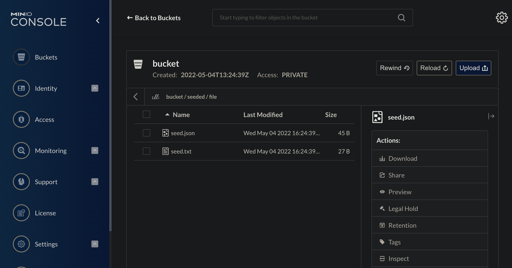

# S3

В данном руководстве описана загрузка данных (сидирование) в `s3`.

## Настройка окружения

Получите рабочую копию репозитория `seeder`:

```shell
git clone https://github.com/pkorobeinikov/seeder.git
```

Перейдите в каталог `seeder-showcase/s3`:

```shell
cd seeder-showcase/s3
```

Разверните локальное окружение:

```shell
docker compose up -d
```

!!! note

    Если у вас не настроено расширение `compose`, самое время перейти на него
    или продолжить использовать устаревшую команду `docker-compose`.

## Изучение демонстрационных данных

Рассмотрите спецификацию описания сидов:

```shell
cat seeder.yaml
```

<!-- @formatter:off -->
```yaml title="seeder-showcase/s3/seeder.yaml"
seeder:
  state:
    - name: s3 plain text file seed
      type: s3
      config:
        - bucket: "bucket" # (1)
          object-name: "seeded/file/seed.txt" # (2)
          option:
            content-type: text/plain
            content-encoding: utf8
          file: seed/seed.txt # (3)

    - name: s3 json file seed
      type: s3
      config:
        - bucket: "bucket"
          object-name: "seeded/file/seed.json"
          option:
            content-type: application/json
            content-encoding: utf8
          file: seed/seed.json
```
<!-- @formatter:on -->

1. Имя бакета для загрузки данных
2. Имя, под которым объект будет загружен в `s3`
3. Имя загружаемого объекта в локальной файловой системе

## Загрузка данных

Для загрузки данных выполните команду:

```shell
export SEEDER_S3_ENDPOINT=localhost:9100
export SEEDER_S3_ACCESS_KEY_ID=minio
export SEEDER_S3_SECRET_ACCESS_KEY=miniosecret

seeder
```

!!! note

    Если вы не используете `Docker Desktop`, вам, возможно, потребуется
    заменить `localhost` в строке подключения на правильное имя хоста
    или адрес машины с `dockerd`.

## Проверка результата

Наиболее простой способ проверить сидирование `s3` — зайти в консоль и изучить
содержимое бакетов.

Перейдите по адресу `http://localhost:9101`, авторизуйтесь с логином `minio` и
паролем `miniosecret`, и перейдите в раздел `Buckets`. В нём вы обнаружите оба
загруженных файла:

<figure markdown>
  
  <figcaption>Список объектов бакета</figcaption>
</figure>

## Остановка локального окружения

Для остановки локального окружения выполните команду:

```shell
docker compose down
```

## Резюме

В приведённом руководстве:

- Было развёрнуто локальное окружение с `s3` для загрузки демонстрационных
  данных (сидов);
- Изучен формат описания сидов для `s3`;
- Демонстрационные данные загружены в `s3`.
